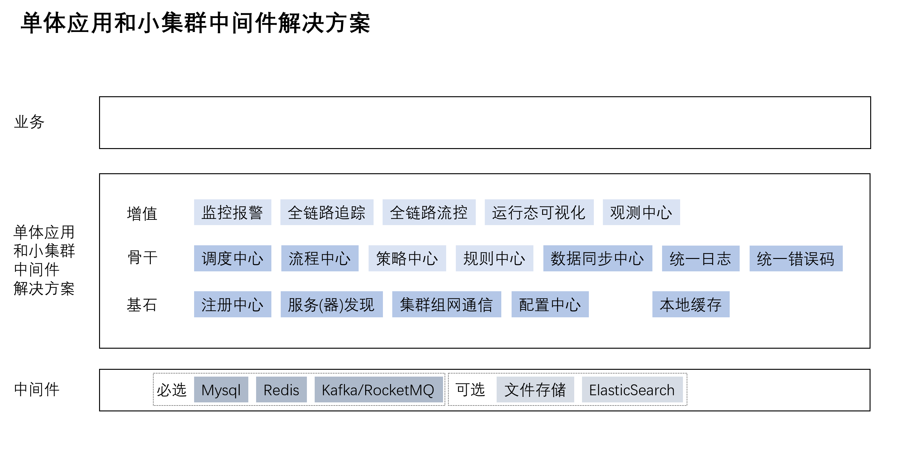

# Winter 项目模块功能说明

## 项目概述

Winter 是一个面向单体应用和小集群的嵌入式中间件解决方案，基于 MySQL/Redis 构建，避免引入额外的中间件以降低维护成本。该项目提供可配置、可编排、可扩展、可分布式部署的基础能力，在满足常见使用场景的同时，降低开发成本，提升开发效率。

## 核心架构

```
┌─────────────────────────────────────────────────────────────┐
│                    Winter 分布式中间件套件                      │
└─────────────────────────────────────────────────────────────┘
                              │
        ┌─────────────────────┼─────────────────────┐
        │                     │                     │
   ┌────▼────┐          ┌────▼────┐          ┌────▼────┐
   │ 基础层  │          │ 核心层  │          │ 应用层  │
   └────┬────┘          └────┬────┘          └────┬────┘
        │                     │                     │
   ┌────▼─────────────────────▼─────────────────────▼────┐
   │ winter-embed-base (基础模块)                          │
   │ winter-embed-common-tools (通用工具集)                │
   └──────────────────────────────────────────────────────┘
        │
   ┌────▼──────────────────────────────────────────────────┐
   │ winter-embed-config-center (配置中心)                 │
   │   └─── winter-embed-register-center (注册中心)        │
   │   └─── winter-embed-rpc (RPC 框架)                    │
   │   └─── winter-embed-scheduler-center (调度中心)       │
   └──────────────────────────────────────────────────────┘
        │
   ┌────▼──────────────────────────────────────────────────┐
   │ winter-embed-data-sync (数据同步)                     │
   │ winter-embed-web-manager (Web 管理工具)               │
   └──────────────────────────────────────────────────────┘
```


### 架构设计图



## 模块详细说明

### 1. winter-embed-base (基础模块)

**状态**: Release  
**类型**: 基础模块  
**功能**: 提供项目的基础依赖管理和公共配置，作为所有其他模块的父模块，定义了统一的编译配置、依赖版本管理等基础设施。

### 2. winter-embed-common-tools (通用工具集)

**状态**: Release  
**类型**: 主要模块  
**功能**: 提供高阶的常用工具类，主要供项目内部使用。包含以下工具包：

- **cache**: 缓存工具（基于 Caffeine）
- **http**: HTTP 客户端工具（基于 OkHttp）
- **id**: 分布式 ID 生成工具
- **json**: JSON 处理工具（基于 Jackson）
- **lock**: 分布式锁工具（基于 Redis）
- **ratelimiter**: 限流工具
- **result**: 统一结果封装
- **semaphore**: 信号量工具
- **spring**: Spring 集成工具
- **system**: 系统工具
- **threadpool**: 线程池工具
- **trace**: 链路追踪工具
- **util**: 通用工具类

### 3. winter-embed-config-center (配置中心)

**状态**: Release  
**类型**: 主要模块  
**功能**: 嵌入式配置中心，基于 MySQL 提供秒级配置变更推送能力。

**核心特性**:
- 支持配置的动态更新和实时推送
- 使用 MySQL 函数 `current_timestamp(3)` 实现精确时间戳
- 需要确保服务器和客户端时间一致（误差在 1 秒内）
- 提供数据库表结构：`winter_embed_config_center.sql`

**使用方式**:
- Spring Boot 工程可直接启动
- Spring 工程需要添加自动配置类到扫描路径

**与其他模块关系**:
- 作为整个 Winter 体系的基础设施
- 为注册中心、RPC 框架等提供配置管理能力

### 4. winter-embed-register-center (注册中心)

**状态**: Beta  
**类型**: 次要模块  
**功能**: 嵌入式注册中心，提供集群的 IP 发现、服务注册和发现功能。

**核心特性**:
- 参考 Nacos 的命名服务设计
- 采用 `serviceName --> ip:port --> 服务详细元数据` 的注册形式
- 基于 config-center 实现，复用配置中心的基础设施

**与其他模块关系**:
- 依赖 winter-embed-config-center
- 为 winter-embed-rpc 提供服务注册和发现能力

### 5. winter-embed-rpc (RPC 框架)

**状态**: Release  
**类型**: 主要模块  
**功能**: 嵌入式 RPC 框架，提供基本的服务注册、服务远程调用功能。

**核心特性**:
- 基于 HTTP(S) 提供远程调用
- 支持内网集群负载均衡调用
- 支持公网、域名调用
- 多网卡场景下可通过 IP 前缀指定使用的 IP 地址
- 支持直接使用 Provider 注册的内存模型进行调用
- 提供 Filter 扩展机制
- 支持 Hessian 和 JSON 序列化

**URL 格式**:
```
winterrpc://ip:port/serviceName?methods=a,b,c&其他自定义参数
```

**示例**:
```
winterrpc://10.0.0.1:7788/tech.obiteaaron.winter.embed.rpc.UserService?methods=findById(java.lang.String),findByOpenId(java.lang.String)&type=provider
```

**与其他模块关系**:
- 依赖 winter-embed-config-center 和 winter-embed-register-center
- 为 winter-embed-scheduler-center 提供 MapReduce 任务分发能力

**与 Dubbo 的区别**:
- Winter RPC 主要解决本应用内部的 RPC 调用以及基于公网 HTTP 的跨应用调用
- 支持 JSON 格式，可用 curl 和浏览器访问
- 实现更简单，适合中小型系统

### 6. winter-embed-scheduler-center (调度中心)

**状态**: Beta  
**类型**: 主要模块  
**功能**: 嵌入式调度中心，提供集群内的任务调度能力。

**核心特性**:
- 参考 Akka 和 Actor 模型，定义 Actor 工作节点模型
- 以 RPC 框架为核心，注册 Actor，构建内网集群
- 支持负载均衡调用和广播调用
- 使用时间轮算法实现多线程环境下的定时器（类似 Netty、Kafka）

**任务类型**:
1. **单机任务**: 类似 Spring 的 `@Scheduled`
2. **单机常驻任务**: 长期运行的任务
3. **Map 任务**: 分发子任务到集群节点
4. **MapReduce 任务**: 分布式 MapReduce 任务
5. **DAG 任务**: 有向无环图任务（规划中）

**定时器选择**:
- 时间轮（多线程）: Netty、Kafka、PowerJob，最终选择使用时间轮。
- 最小堆（单线程）: libevent、Go
- 跳表（单线程）: Redis
- 红黑树（单线程）: Nginx

**持久化**:
- 可选持久化任务信息和任务实例信息到数据库
- 默认不持久化，无需数据源或建数据表
- 提供数据库表结构：`winter_embed_scheduler_center.sql`

**与其他模块关系**:
- 依赖 winter-embed-rpc 实现 Map 和 MapReduce 任务分发
- 可选依赖 config-center 进行配置管理

### 7. winter-embed-data-sync (数据同步)

**状态**: Planning  
**类型**: 次要模块  
**功能**: 基于数据库表扫描的数据同步工具。

**核心特性**:
- 基于数据扫描的方式，无需 binlog 技术
- 实现从一个数据源（如 MySQL）同步到另一个数据源（如 MySQL）
- 扫描模式存在一定延迟，适合非实时业务场景

**适用场景**:
- 历史库迁移备份
- 实时业务库到离线分析库
- 简单场景下的数据同步问题

### 8. winter-embed-web-manager (Web 管理工具)

**状态**: Planning  
**类型**: 次要模块  
**功能**: 嵌入式 Web 管理工具，提供可视化的管理界面。

**管理功能**:
- 配置项管理
- 调度任务管理
- 线程池管理
- BPMN 流程管理

### 9. winter-embed-strategy-center (策略中心)

**状态**: Planning  
**类型**: 主要模块  
**功能**: 嵌入式策略中心，实现基本的策略模式。

**核心特性**:
- 可用于内外部的系统扩展
- 实现系统的扩展和插件功能
- 支持动态策略加载和执行

### 10. winter-embed-workflow-engine (流程引擎)

**状态**: Release  
**类型**: 主要模块  
**功能**: 嵌入式流程引擎，基于 SmartEngine 扩展。

**核心特性**:
- 实现基于内存的高性能 BPMN 流程执行引擎
- 支持流程定义、流程实例管理
- 提供流程监控和管理能力

**注意**: 该模块直接在 Fork 的 Github 仓库更新，不嵌入当前仓库
- 仓库地址: [SmartEngine-Enhance](https://github.com/obiteaaron/SmartEngine-Enhance)

## 模块依赖关系

```
winter-embed-base
    │
    ├─> winter-embed-common-tools
    │
    ├─> winter-embed-config-center
    │       │
    │       ├─> winter-embed-register-center
    │       │       │
    │       │       └─> winter-embed-rpc
    │       │               │
    │       │               └─> winter-embed-scheduler-center
    │       │
    │       └─> winter-embed-web-manager
    │
    └─> winter-embed-data-sync
```

## 技术栈

- **Java**: 8
- **Spring Boot**: 2.3.12.RELEASE
- **Spring Framework**: 5.2.15.RELEASE
- **Netty**: 4.1.106.Final
- **Jackson**: 2.13.3
- **Cron Utils**: 9.2.1
- **MySQL**: 8.0.28
- **Redis**: Lettuce 6.1.8.RELEASE
- **OkHttp**: 4.12.0
- **Caffeine**: 2.9.3
- **Guava**: 33.0.0-jre
- **Hessian**: 4.0.66

## 使用场景

1. **单体应用**: 通过配置中心实现配置动态管理
2. **小集群应用**: 通过注册中心和 RPC 框架实现服务间通信
3. **分布式任务调度**: 通过调度中心实现集群任务分发和执行
4. **数据迁移**: 通过数据同步工具实现数据迁移和备份
5. **流程自动化**: 通过流程引擎实现业务流程编排

## 快速开始

### 1. 打包安装

```bash
# 拉取代码
git clone https://gitee.com/zhanlanstar/winter.git

# 打包到本地 Maven 仓库
mvn clean install
```

### 2. 引入依赖

```xml
<dependency>
    <groupId>tech.obiteaaron.winter</groupId>
    <artifactId>winter-embed-config-center</artifactId>
    <version>1.1.0-SNAPSHOT</version>
</dependency>
```

### 3. 配置数据源

在 `application.properties` 中配置数据源：

```properties
spring.datasource.url=jdbc:mysql://localhost:3306/winter
spring.datasource.username=root
spring.datasource.password=password
```

### 4. 初始化数据库

执行对应模块的 SQL 文件：
- `winter-embed-config-center/src/main/resources/winter_embed_config_center.sql`
- `winter-embed-scheduler-center/src/main/resources/winter_embed_scheduler_center.sql`

### 5. 启动应用

Spring Boot 工程可直接启动，Spring 工程需要添加自动配置类到扫描路径。

## 注意事项

1. **时间同步**: 配置中心使用 `current_timestamp(3)` 函数，需要确保服务器和客户端时间一致（误差在 1 秒内）
2. **性能考虑**: Winter RPC 的实现不是非常注重性能，主要在中小型系统中使用
3. **安全性**: 内网可使用 HTTP 协议，公网建议使用 HTTPS 协议
4. **持久化**: 调度中心默认不持久化，如需持久化需要配置数据源

## 版本说明

- **Release**: 稳定版本，可用于生产环境
- **Beta**: 测试版本，功能基本完成，可能存在 bug
- **Planning**: 规划中，尚未实现

## 贡献指南

欢迎提交 Issue 和 Pull Request 来改进这个项目。

## 许可证

本项目采用开源许可证，详见 LICENSE 文件。
